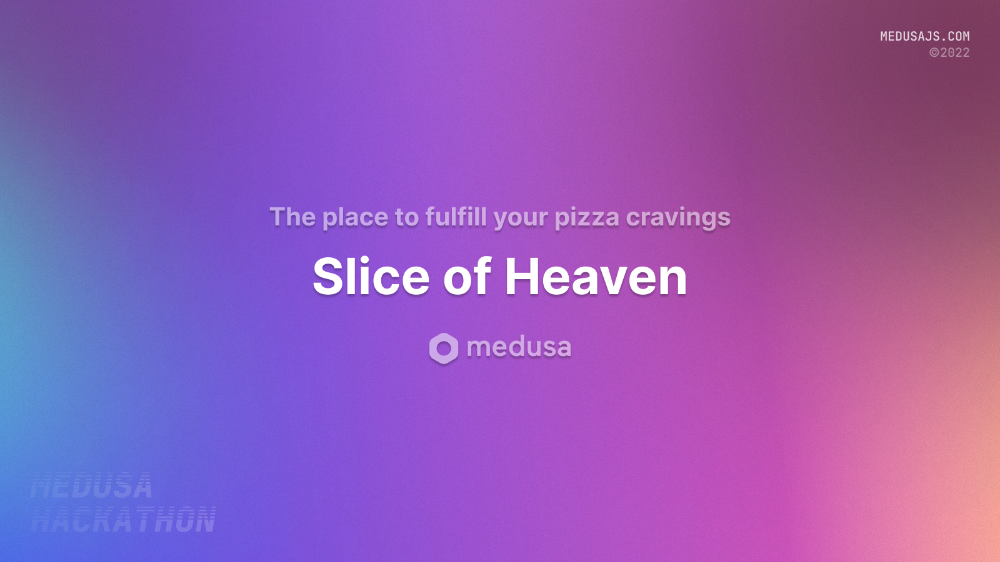

# Slice of Heaven

## Cover Image



## About

### Participants

#### Nikhil Shanbhag

Github : @Nikhil-1503 <br></br>
Discord : nikhil.1503#9740 <br></br>
Twitter : @Nikhil_1503

### Description

A pizza shop storefront powered by using NextJs combined with MedusaJs.

### Preview

#### GIFs

- HomePage <br/><br/>

- Products and Collection <br/><br/>

- Price Change On Choosing Different Combination <br/><br/>

- Cart and Checkout <br/><br/>

## Set up Project

#### Screenshots


You need following requirement to setup your project:

### Prerequisites

- Medusa CLI (```npm install -g @medusajs/medusa-cli```) .
- Redis (https://redis.io/)
- PostgreSQL (https://www.postgresql.org/)
- Node (https://node.org/)

### Install Project

1. Clone the repository:

```bash
git clone https://github.com/Nikhil-1503/slice-of-heaven.git
```

2. Change directory and install dependencies:

```bash
cd slice-of-heaven
cd backend
medusa develop
```

3. Open another terminal from slice-of-heaven folder:
```bash
cd storefront 
npm install
npm run dev
```

4. Open the project in your browser:
```bash
http://localhost:8000
```

## Resources
- [Medusa’s GitHub repository](https://github.com/medusajs/medusa)
- [Medusa Admin Panel](https://github.com/medusajs/admin)
- [Medusa Documentation](https://docs.medusajs.com/)
- [Medusa Next.js Starter](https://github.com/medusajs/nextjs-starter-medusa)
